## Highlights of my advised Graduation Projects & Theses

-----------------------------------

### Deep Visual Speech Recognition (Lip Reading)

### AUC, CSE Department, Spring 2021

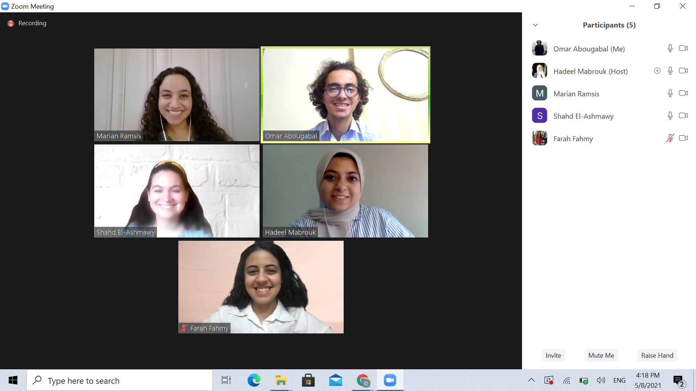
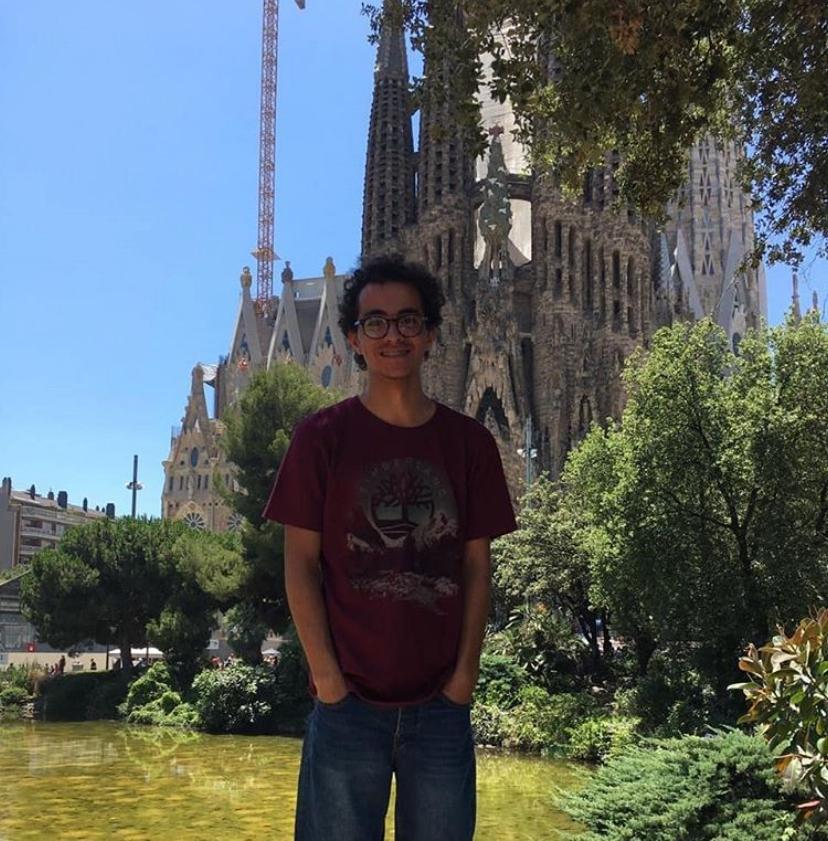

Team: Hadeel Mabrouk - Omar Abugabal - Shahd El-Ashmawy - Marian Ramsis - Farah El-Ashmawy

In this work, we propose a technique to transfer speech recognition capabilities from audio speech recognition systems to visual speech recognizers, where our goal is to utilize audio data during lipreading model training. Impressive progress in the domain of speech recognition has been exhibited by audio and audio-visual systems. Nevertheless, there is still much to be explored with regards to visual speech recognition systems due to the visual ambiguity of some phonemes. To this end, the development of visual speech recognition models is crucial given the instability of audio models. The main contributions of this work are i) building on recent state-of-the-art word-based lipreading models by integrating sequence-level and frame-level Knowledge Distillation (KD) to their systems; ii) leveraging audio data during training visual models, a feat which has not been utilized in prior word-based work; iii) proposing the Gaussian-shaped averaging in frame-level KD, as an efficient technique that aids the model in distilling knowledge at the sequence model encoder. This work proposes a novel and competitive architecture for lip-reading, as we demonstrate a noticeable improvement in performance, setting a new benchmark equals to 88.64% on the LRW dataset.

-----------------------------------

### Autonomous Disinfection Robot {#auto_disinfect_robo}

### AUC, MENG Department, Spring 2021

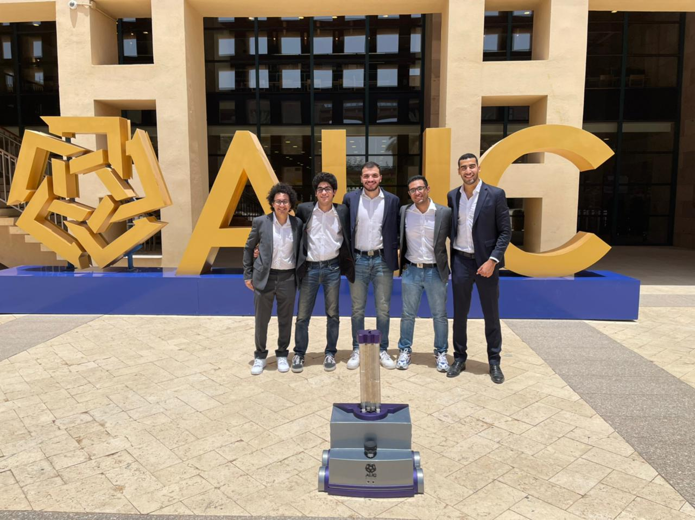

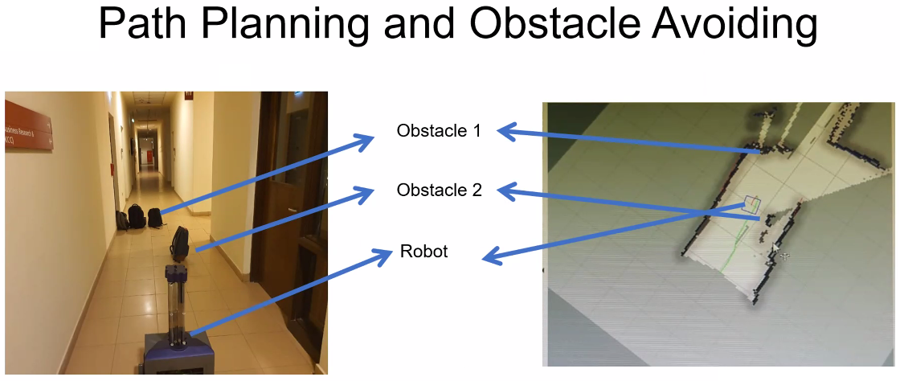
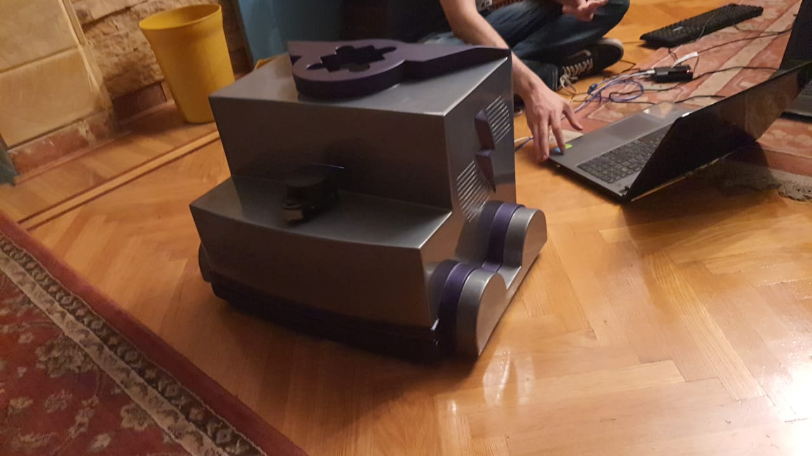
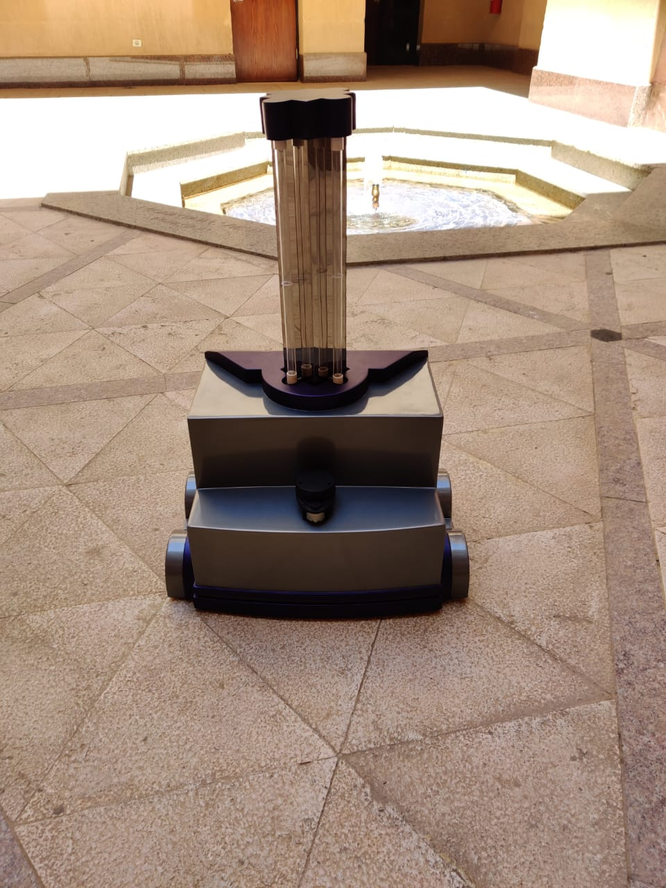

Team: Hamdy Ibrahim - Mostafa Karakish - Ahmed el Sakhawi - Aly Kassem - Omar Ibrahim

As COVID-19 spreads across the globe, hospitals, schools, and working areas have become ground zero for the virus. The project aims to design an autonomous disinfection robot using ultraviolet rays (UV-C) approach. This report describes the robot design, including sensors, embedded systems, mechanical parts and materials, and the Integration of both of them. The materials used are mainly aluminum, acrylic, and glass fiber to provide the required strength without increasing the weight. The results show that the robot can draw a map and localize itself within this map. Moreover, it also detects humans in the room and turns off the lamps to prevent human exposure to harmful UV radiation. The reach and efficacy of the UV lamps tests failed due to limitations of budget, time and unavailability of the required sensor to perform the tests. 

[Link to Demo Video](https://www.youtube.com/watch?v=FM9TTGmkSD0)

-----------------------------------

### Pervasive Sonar-based Smartphones Control Suite

### AUC, CSE Department, Fall 2021

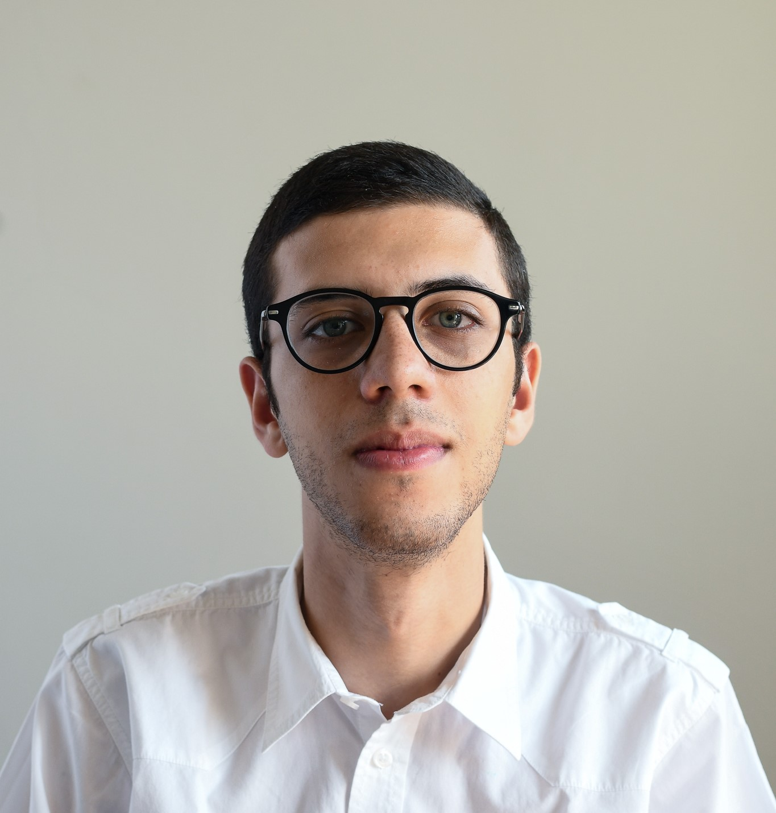
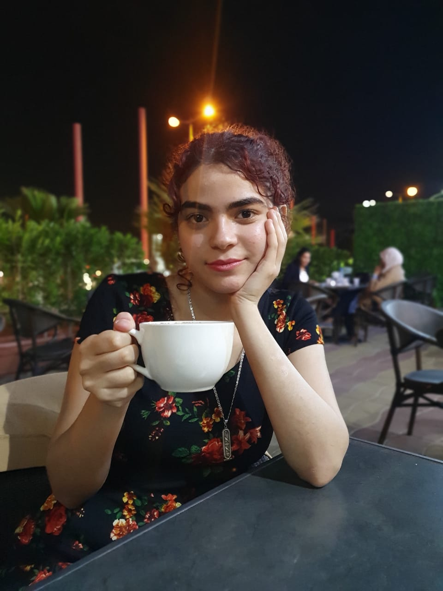
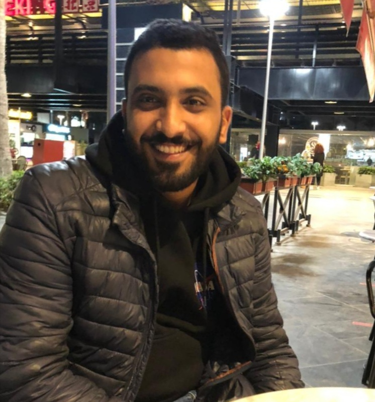
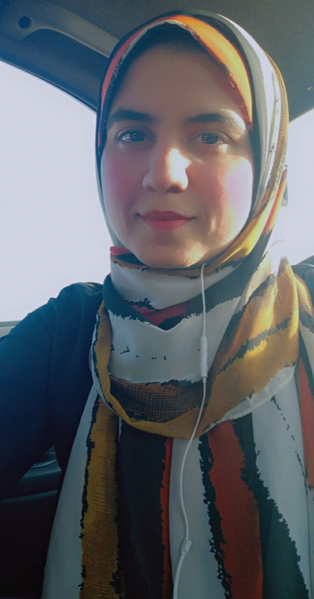

Team: Ayman El-Refai - Sara Ahmed - Ahmed M. Ibrahim - Ahmed Ibrahim - Mariam Abul-Ela 

Due to the mass advancement in ubiquitous technologies nowadays, new pervasive methods have come into practice to provide new innovative features and stimulate the research on new human-computer interactions. Handheld devices are expected to recognize a user's movements as its integral to the human-machine interaction. In this paper, we present SonarWAV, a hand gesture classification system that uses the smartphone's built-in speakers and microphones to detect the hand movement around the user's smartphone.
The proposed method emits an ultrasonic sonar-based signal from the smartphone's stereo speakers, which is then received by the smartphone's microphone, and then converted to a spectrogram short-time Fourier transform. That spectrogram is then used as input to a CNN model which then recognizes such a gesture. This study compares different types of CNN models based on the input to the model. The first takes the dual channel audio as 1 channel image of the spectrogram (Basic CNN), the second takes the dual channels spectrogram (top and bottom) and concatenates them as an input to the model (Early Fusion), the third takes two spectrograms of the bottom and top channels, and learns each channel on its own then merges the result at the end of the model (Late Fusion). Our results show that our system can detect the six gestures with an accuracy of 93.58% using the Early Fusion model based on Xception.

[Link to Demo Video](https://youtu.be/I8HhX1JGzFw)

-----------------------------------

### Reactive Collision Avoidance using Evolutionary Neural Networks

### AUC, CSE Department, Spring 2020

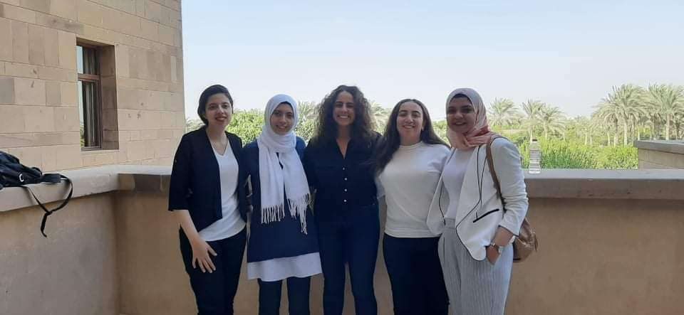
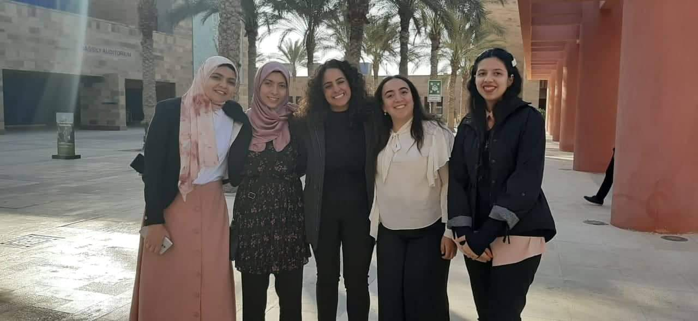

Team: Heba Hussein - Mariam Gaafar - Mariam Mohamed - Aya Moemen - Melissa Milad

Implementing collision avoidance mechanism in automated guided vehicles (AGV) using Evolutionary Neural Networks. The network first learns the weights in a simulated environment in Gazebo simulator, then the weights are transferred to the AGV network which continues to improve the learned weights in the real environment. 

[Link to Demo Video](https://www.youtube.com/watch?v=QI_payyxkng)

-----------------------------------

### CIL Self-Driving Car

### Electronics and communication Department, Faculty of Engineering, Alexandria University, Spring 2020

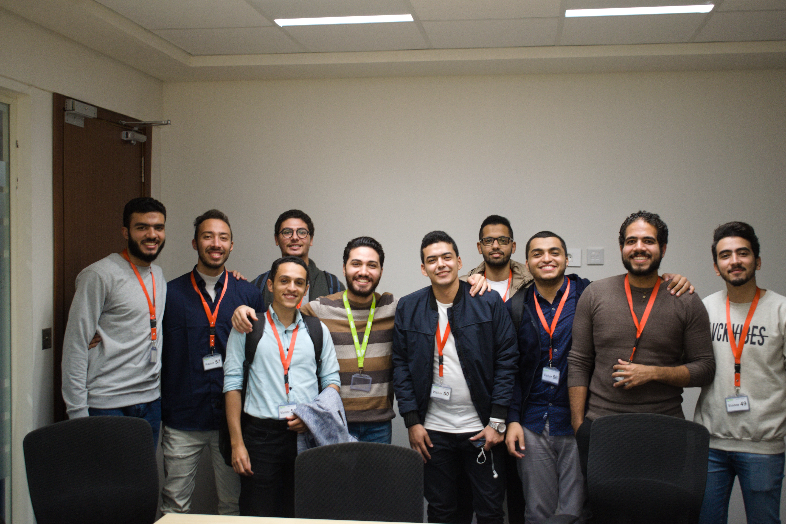
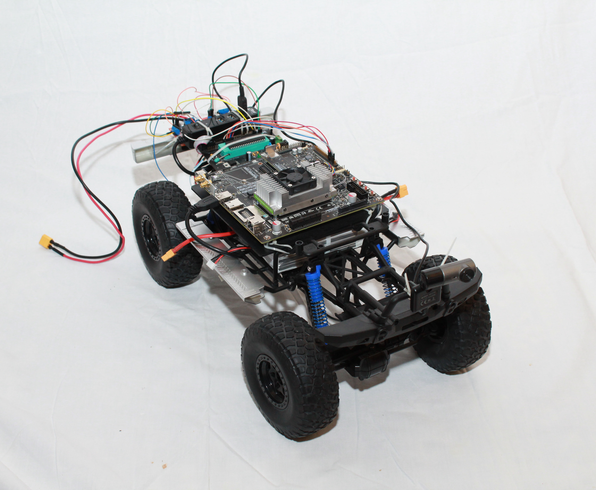

Team: Ahmed Hossam Mohamed Ali - Ahmed Mohamed Sleem Abd-Alaal - Ahmed Mohamed Abd-Elkarim Mohamed Gomaa - Ahmed Mohamed Mohamed Abd-Elmonem Zahwy - Ahmed Mohamed Mohamed Mahmoud Hamza - Adham Fattouh Saad Hussein Metwally - Abdullah Adel Gaber Hassan Ali - Omar Khamis Mohamed Ahmed Shokr - Mahmoud Mohamed Abdullah Mansour - Nour El-din Abd-Elfatah Mohamed El-Sayed

A self-driving car based on Conditional Imitation Learning. The project was sponsored by Valeo.

[Link to Book](https://drive.google.com/file/d/1gwFsM2j0LD8De2MsG0oRhf2om11WxQE7/view?usp=sharing)

[Link to Demo Video](https://www.youtube.com/watch?v=4CmXf6s6GtM)

-----------------------------------