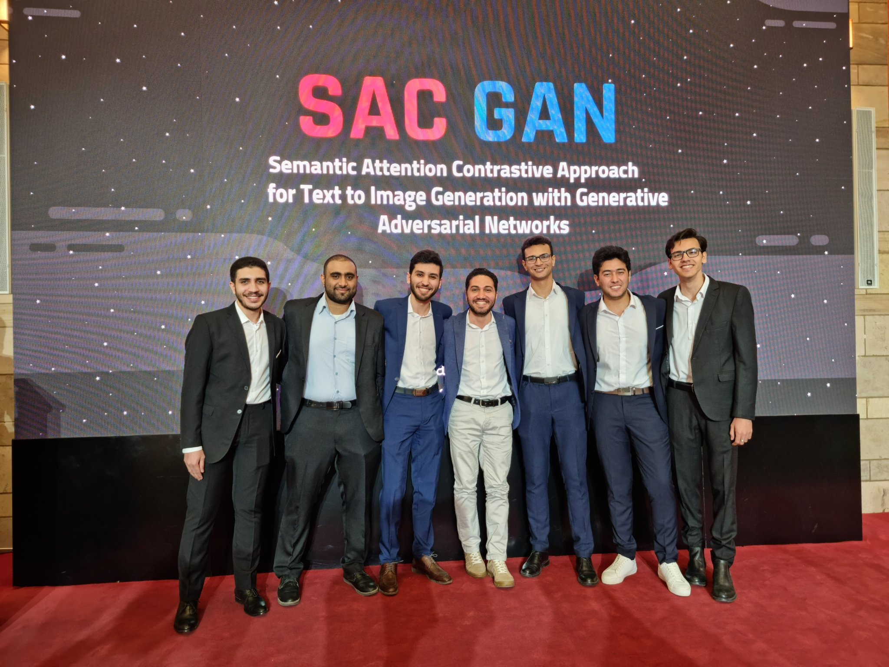
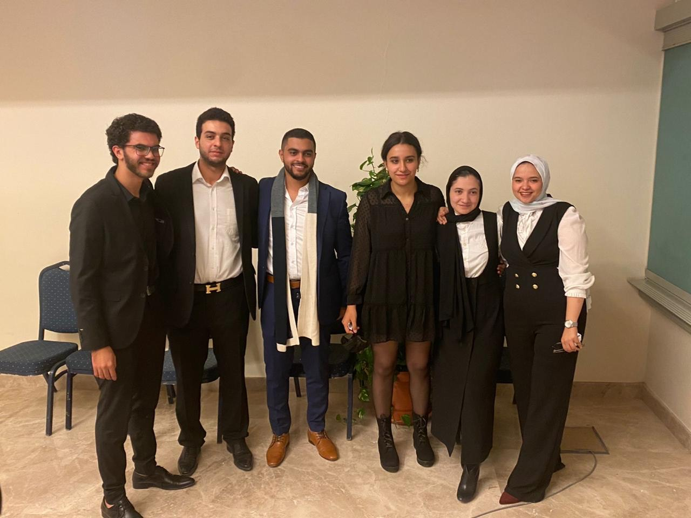
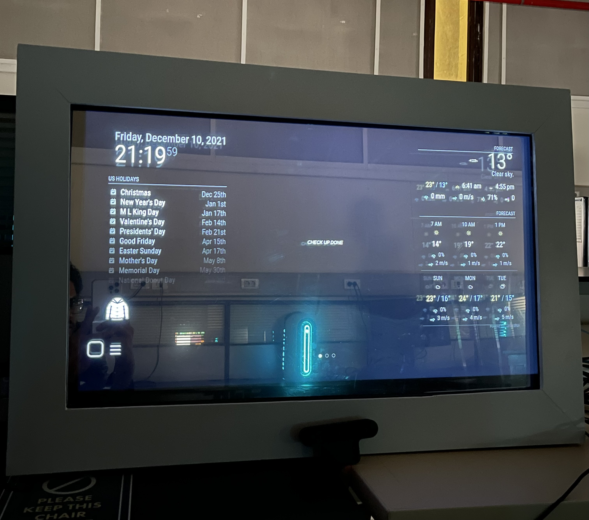
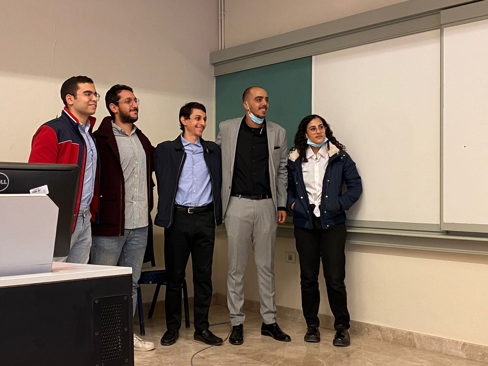
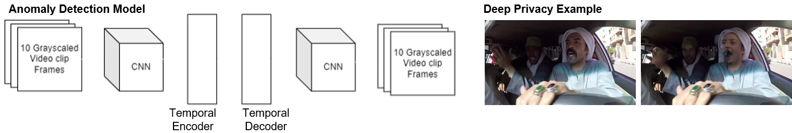

# Highlights of advised Graduation Projects & Theses

-----------------------------------

### RBPGAN: Recurrent Back-Projection GAN for Video Super Resolution

### AUC, CSE Department, Spring 2022

Team: Dareen Hussein - Israa Fahmy - Marwah Sulaiman - Mohammed Barakat - Mohammed El-Naggar - Zahraa Shehabeldin

[Link to Project Presentation Recording](https://www.youtube.com/watch?v=KkbRlUNGXAs)

-----------------------------------

### The Right Losses for the Right Gains: Improving the Semantic Consistency of Deep Text-to-Image Generation with Distribution-Sensitive Losses

### AUC, CSE Department, Spring 2022

Team: Mahmoud Ahmed - Omer Moussa - Ismail Shaheen - Mohamed Abdelfattah - Amr Abdallah - Marwan Eid

-----------------------------------

### The Right Losses for the Right Gains: Improving the Semantic Consistency of Deep Text-to-Image Generation with Distribution-Sensitive Losses

### AUC, CSE Department, Spring 2022

Team: Abdelhakim Badawy - Samah Hussien - Yahya Abbas - Samah Ayman - Mohamed Shahawy - Hoda Ahmed

-----------------------------------

### Deep Visual Speech Recognition (Lip Reading)

### AUC, CSE Department, Spring 2021

Team: Hadeel Mabrouk - Omar Abugabal - Shahd El-Ashmawy - Marian Ramsis - Farah El-Ashmawy

In this work, we propose a technique to transfer speech recognition capabilities from audio speech recognition systems to visual speech recognizers, where our goal is to utilize audio data during lipreading model training. Impressive progress in the domain of speech recognition has been exhibited by audio and audio-visual systems. Nevertheless, there is still much to be explored with regards to visual speech recognition systems due to the visual ambiguity of some phonemes. To this end, the development of visual speech recognition models is crucial given the instability of audio models. The main contributions of this work are i) building on recent state-of-the-art word-based lipreading models by integrating sequence-level and frame-level Knowledge Distillation (KD) to their systems; ii) leveraging audio data during training visual models, a feat which has not been utilized in prior word-based work; iii) proposing the Gaussian-shaped averaging in frame-level KD, as an efficient technique that aids the model in distilling knowledge at the sequence model encoder. This work proposes a novel and competitive architecture for lip-reading, as we demonstrate a noticeable improvement in performance, setting a new benchmark equals to 88.64% on the LRW dataset.

* [Paper Link](https://arxiv.org/abs/2108.03543)
* Citation: Marian Ramsis, Shahd Elashmawy, Hesham M. Eraqi, Farah Eldeshnawy, Hadeel Mabrouk, Omar Gabal, and Nourhan Sakr. Spatio-Temporal Attention Mechanism and Knowledge Distillation for Lip Reading. The 13rd International Joint Conference on Computational Intelligence (IJCCI), 2021.

-----------------------------------

### Autonomous Disinfection Robot

### AUC, MENG Department, Spring 2021

Team: Hamdy Ibrahim - Mostafa Karakish - Ahmed el Sakhawi - Aly Kassem - Omar Ibrahim

As COVID-19 spreads across the globe, hospitals, schools, and working areas have become ground zero for the virus. The project aims to design an autonomous disinfection robot using ultraviolet rays (UV-C) approach. This report describes the robot design, including sensors, embedded systems, mechanical parts and materials, and the Integration of both of them. The materials used are mainly aluminum, acrylic, and glass fiber to provide the required strength without increasing the weight. The results show that the robot can draw a map and localize itself within this map. Moreover, it also detects humans in the room and turns off the lamps to prevent human exposure to harmful UV radiation. The reach and efficacy of the UV lamps tests failed due to limitations of budget, time and unavailability of the required sensor to perform the tests. 

[Link to Demo Video](https://www.youtube.com/watch?v=FM9TTGmkSD0)

-----------------------------------

### Hand Gesture Recognition for Smartphones using Non-audible Sound and Deep Learning

### AUC, CSE Department, Fall 2021

Team: Ayman El-Refai - Sara Ahmed - Ahmed M. Ibrahim - Ahmed Ibrahim - Mariam Abul-Ela 

Your smartphone can understand your hand gestures without using the camera and, of course, without touching the screen. In this work, we emit ultrasonic sonar-based (inaudible) sound from the phone speakers and analyze the signal received from the microphone with Deep Learning to achieve the task and apply some tricks to improve the model accuracy. The dataset is publicly available!

* [Paper Link](https://arxiv.org/abs/2108.02148)
* [Data Link](https://drive.google.com/drive/u/2/folders/19Me8bCMPyCm1NOr6rk7apOiCOQXLmdqY)
* Citation: Ahmed Ibrahim, Ayman El-Refai, Sara Ahmed, Mariam Aboul-Ela, Ahmed Khalel, Hesham M. Eraqi, Mohamed Moustafa. Pervasive Hand Gesture Recognition for Smartphones using Non-audible Sound and Deep Learning. The 13rd International Joint Conference on Computational Intelligence (IJCCI), 2021.
* [Link to Demo Video](https://youtu.be/I8HhX1JGzFw)

-----------------------------------

### Fortune AI: Utilizing Machine Learning for Venture Capital Evaluation

### AUC, CSE Department, Spring 2022

Team: Habeeba Sakr - Mostafa Elsharkawy - Mohamed Basuony - Nouran Ibrahim - Omar Elewa

-----------------------------------

### Smart Mirror

### AUC, CSE Department, Fall 2021

Team: Abdelrahman Rezk - Ashraf Mohammed Ibrahim - Shorouk Maged Beshara - Nourhan Mohamed Mokbel - Nour Gamal Moussa - Omar Mohamed Kamaly

The team developed a Smart Mirror commercial product that can be used in the E-Health field by persons who require a regular check-up analysis. Since the spread of the COVID-19 pandemic, people avoid going to hospitals and private clinics to stay away from big crowds. So, the product provides a quick analysis that includes in body analysis, vital signs, iris detection, and emotional state detection from the user and gives him/her predictions and suggestions if there are some sort of abnormalities. The system can be used in smart homes, gyms, and hotels, it aims to ease the process of check-ups in a safer and easier way.

[Link to Demo Video](https://www.youtube.com/watch?v=uPcbh0mfovA)

-----------------------------------

### In-vehicle Violence Detection

### AUC, CSE Department, Fall 2021

Team: Ismael Elsharkawi - Eyad Shaban - Youssef Khalifa - Farida Tarek - Basel Shabana

This project has introduced a novel dataset featuring both violent and non-violent actions recorded in-car from multiple views and an in-car violence detection autoencoder model for Anomaly Detection.

-----------------------------------

### Reactive Collision Avoidance using Evolutionary Neural Networks

### AUC, CSE Department, Spring 2020

Team: Heba Hussein - Mariam Gaafar - Mariam Mohamed - Aya Moemen - Melissa Milad

Implementing collision avoidance mechanism in automated guided vehicles (AGV) using Evolutionary Neural Networks. The network first learns the weights in a simulated environment in Gazebo simulator, then the weights are transferred to the AGV network which continues to improve the learned weights in the real environment. 

[Link to Demo Video](https://www.youtube.com/watch?v=QI_payyxkng)

-----------------------------------

### CIL Self-Driving Car

### Electronics and communication Department, Faculty of Engineering, Alexandria University, Spring 2020

Team: Ahmed Hossam Mohamed Ali - Ahmed Mohamed Sleem Abd-Alaal - Ahmed Mohamed Abd-Elkarim Mohamed Gomaa - Ahmed Mohamed Mohamed Abd-Elmonem Zahwy - Ahmed Mohamed Mohamed Mahmoud Hamza - Adham Fattouh Saad Hussein Metwally - Abdullah Adel Gaber Hassan Ali - Omar Khamis Mohamed Ahmed Shokr - Mahmoud Mohamed Abdullah Mansour - Nour El-din Abd-Elfatah Mohamed El-Sayed

A self-driving car based on Conditional Imitation Learning. The project was sponsored by Valeo.

[Link to Book](https://drive.google.com/file/d/1gwFsM2j0LD8De2MsG0oRhf2om11WxQE7/view?usp=sharing)

[Link to Demo Video](https://www.youtube.com/watch?v=4CmXf6s6GtM)

-----------------------------------

### Classroom Monitoring Using AI-vProctor

### AUC, CSE Department, Spring 2022

Team: Noha Alshabrawy Abdelkader - Mohamed Elsayed Elshabshiri - Marwan Amr Awad - Omar Sherif Elmahdy - Mohamed Ashraf Taha - Youssef Khaled Beshir

-----------------------------------

### Sign Language Translator Using Hand Pose Estimation and Deep Learning

### AUC, CSE Department, Spring 2022

Team: Ahmed Ahmed - Bassel Halabi - Chris Amgad - Feras Awaga - Mohammed Mostafa Safo - Seif ElDin El Moghazy

-----------------------------------